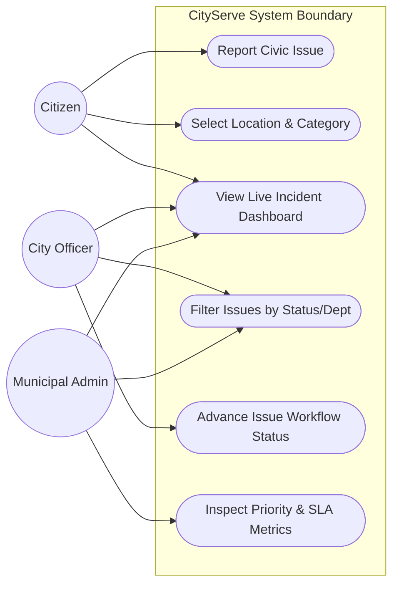
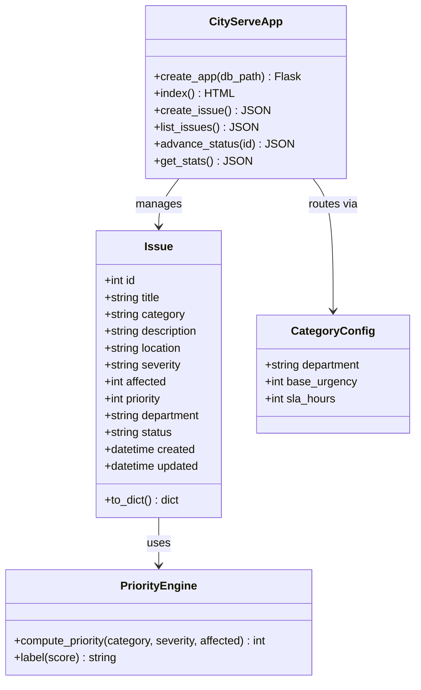
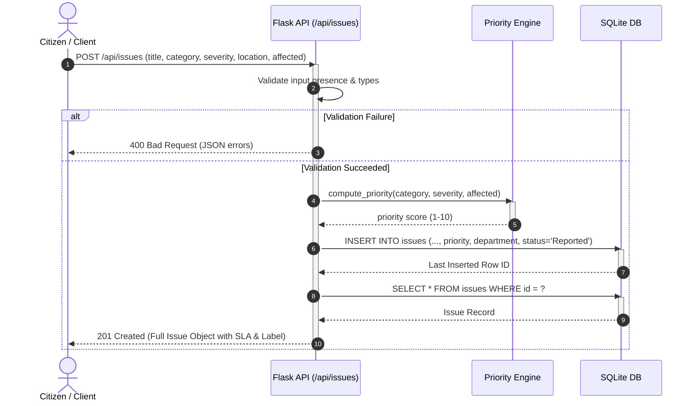
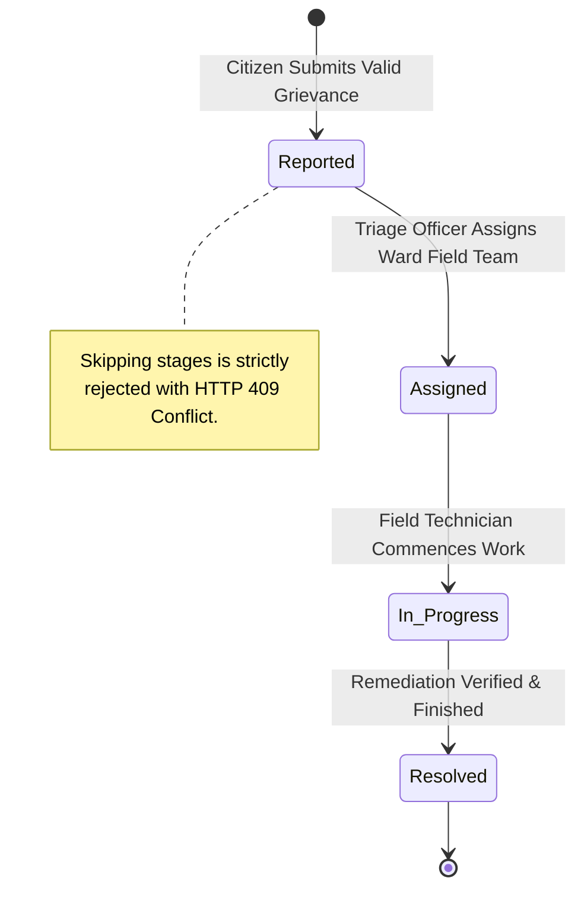

# 🏙️ CityServe - Smart City Civic Service Application

[](https://www.python.org/)
[](https://flask.palletsprojects.com/)
[](https://www.sqlite.org/)
[](test_app.py)
[](test_results_summary.txt)
[](jira_import.csv)
[](https://sdgs.un.org/goals/goal9)
[](https://sdgs.un.org/goals/goal11)

> **Software Engineering and Project Management (SEPM) Micro-Project Prototype**  
> An agile, automated civic issue reporting, intelligent mathematical prioritization, and SLA-driven departmental routing platform for modern smart cities.

---

## 📋 Table of Contents
- [Executive Summary](#-executive-summary)
- [Sustainable Development Goals (SDGs)](#-sustainable-development-goals-sdgs)
- [Core Features & Architecture](#-core-features--architecture)
- [Mathematical Priority Engine](#-mathematical-priority-engine)
- [SLA & Departmental Routing Matrix](#-sla--departmental-routing-matrix)
- [System Modeling & UML Diagrams](#-system-modeling--uml-diagrams)
  - [Use Case Diagram](#1-use-case-diagram)
  - [Class Diagram](#2-class-diagram)
  - [Sequence Diagram](#3-sequence-diagram)
  - [Activity / Workflow State Diagram](#4-activity--workflow-state-diagram)
- [Agile Scrum Project Management (Jira)](#-agile-scrum-project-management-jira)
  - [Sprint Breakdown & Velocity](#sprint-breakdown--velocity)
  - [Product Backlog & Epics](#product-backlog--epics)
- [Automated Verification & Test Results](#-automated-verification--test-results)
  - [Test Suite Breakdown](#test-suite-breakdown-20-test-cases)
  - [Security & SQL Injection Hardening](#security--sql-injection-hardening)
- [RESTful API Reference](#-restful-api-reference)
- [Quick Start & Installation](#-quick-start--installation)
- [Project Structure](#-project-structure)

---

## 🌟 Executive Summary

Rapid urbanization places immense pressure on municipal infrastructures. Conventional civic issue management systems are hindered by manual triage delays, subjective urgency ratings, lack of departmental accountability, and non-transparent progress workflows.

**CityServe** addresses these challenges by introducing:
1. **Dynamic Priority Scoring (1–10)**: Computes real-time priority scores based on category baseline urgency, reported severity, citizen reach, and critical-impact accelerators.
2. **Deterministic Departmental Routing & SLA Tracking**: Directs incoming grievances to specialized municipal bodies with contractual Service Level Agreement (SLA) deadlines.
3. **Rigid Agile Workflow State Machine**: Enforces a strict one-way state progression (`Reported` → `Assigned` → `In Progress` → `Resolved`), preventing arbitrary state skipping.
4. **Real-Time Operational Dashboard**: Provides municipal administrators and civic leaders with instant visibility into total, open, resolved, and critical-priority civic incidents.

---

## 🎯 Sustainable Development Goals (SDGs)

CityServe is intentionally architected to align with the **United Nations Sustainable Development Goals**:

* **SDG 9: Industry, Innovation, and Infrastructure (Target 9.1 & 9.c)**
  * Provides dependable, resilient digital civic infrastructure that reduces response latency for public utility failures.
* **SDG 11: Sustainable Cities and Communities (Target 11.1 & 11.6)**
  * Empowers citizens to directly report hazardous waste overflows, roadway potholes, water pipe bursts, and traffic hazards, ensuring clean, safe, and sustainable urban living environments.

---

## ⚙️ Core Features & Architecture

```
┌─────────────────┐         HTTP / JSON         ┌─────────────────────────────────┐
│                 │  ─────────────────────────> │          Flask REST API         │
│  Citizen Web UI │                             │  (Routing, Validation, FSM)     │
│  (Single-Page)  │  <───────────────────────── │                                 │
└─────────────────┘      Real-Time Dashboard    └───────────────┬─────────────────┘
                                                                │
                                            ┌───────────────────┴───────────────────┐
                                            │                                       │
                                            ▼                                       ▼
                                 ┌────────────────────┐                  ┌────────────────────┐
                                 │   Priority Engine  │                  │   SQLite Storage   │
                                 │  (Math Heuristic)  │                  │  (Parametric ORM)  │
                                 └────────────────────┘                  └────────────────────┘
```

- **Frontend**: Lightweight, accessible, single-page responsive interface styled with CSS tokens, modern system fonts, and real-time DOM updates via asynchronous `fetch` calls.
- **Backend**: Python 3 / Flask microframework exposing RESTful JSON endpoints.
- **Persistence**: SQLite relational database with parameterized queries for complete injection defense.

---

## 🧮 Mathematical Priority Engine

Incoming civic grievances are scored dynamically on a normalized scale from **1 to 10**:

$$\text{Priority Score} = \min\Big(10,\; \text{Base Urgency} + \text{Severity Bonus} + \text{Reach Bonus} + \text{High-Severity Accelerator}\Big)$$

### Priority Variables & Weights

| Parameter | Type / Range | Contribution | Description |
| :--- | :--- | :---: | :--- |
| **Base Urgency** | Integer (2 – 5) | $+2$ to $+5$ | Baseline hazard weight defined by civic category |
| **Severity Bonus** | `low`: 0, `medium`: 1, `high`: 2 | $+0$ to $+2$ | User-reported physical impact severity |
| **Reach Bonus** | People Affected count | $+0$, $+1$, $+2$ | $\ge 100 \implies +2$; $\ge 10 \implies +1$; $< 10 \implies +0$ |
| **High Accelerator**| Boolean condition | $+1$ | Granted exclusively if severity is `high` |

### Qualitative Classification Labels
* **Critical**: Score $\ge 8$ (Immediate emergency intervention required)
* **High**: Score $6 - 7$ (Expedited resolution within SLA)
* **Medium**: Score $4 - 5$ (Standard municipal queue)
* **Low**: Score $1 - 3$ (Routine maintenance)

---

## ⏱️ SLA & Departmental Routing Matrix

Issues are routed automatically to designated civic departments upon creation with non-negotiable SLA deadlines:

| Category ID | Display Name | Responsible Department | Base Urgency | SLA (Hours) |
| :--- | :--- | :--- | :---: | :---: |
| `power_outage` | Power Outage | **Electricity Dept** | 5 | **12 hrs** |
| `water_leak` | Water Pipe Leak | **Water Dept** | 4 | **24 hrs** |
| `traffic` | Traffic Signal Failure | **Traffic Police** | 4 | **24 hrs** |
| `waste` | Waste & Garbage Overflow | **Sanitation Dept** | 3 | **48 hrs** |
| `pothole` | Road Pothole Damage | **Roads Dept** | 3 | **72 hrs** |
| `streetlight` | Streetlight Defect | **Electricity Dept** | 2 | **96 hrs** |

---

## 📐 System Modeling & UML Diagrams

### 1. Use Case Diagram



---

### 2. Class Diagram



---

### 3. Sequence Diagram



---

### 4. Activity / Workflow State Diagram



---

## 🏃 Agile Scrum Project Management (Jira)

The project was executed following the **Scrum Framework** over **3 Sprints**, tracked using Jira Software Cloud. All work items were pre-engineered and imported via [`jira_import.csv`](jira_import.csv).

### Sprint Breakdown & Velocity

| Sprint | Goal | User Stories | Story Points | Status |
| :--- | :--- | :---: | :---: | :---: |
| **Sprint 1** | Project charter, requirements elicitation, UML architecture, Gantt/PERT, citizen reporting form, input validation, and SQLite persistence. | S1 – S8 (8 Stories) | **23 pts** | **Completed** |
| **Sprint 2** | Mathematical priority algorithm, automated department routing, 4-step status state machine, filter/sorting API, and responsive web UI. | S9 – S13 (5 Stories) | **21 pts** | **Ready for Execution** |
| **Sprint 3** | Admin KPI dashboard, test suite automation (20/20 test cases), SQL-injection hardening, demo production, and sprint retrospective. | S14 – S18 (5 Stories) | **14 pts** | **Planned** |
| **Total** | **Full Prototype Delivery** | **18 Stories / 4 Epics** | **58 pts** | **100% Estimated** |

### Product Backlog & Epics

```
📦 E1: Requirements & Planning (Medium)
   ├── [S1] Create project charter and scope statement (2 pts)
   ├── [S2] Draw use case diagram (2 pts)
   ├── [S3] Draw class and sequence diagrams (3 pts)
   ├── [S4] Create Gantt chart and PERT network (3 pts)
   └── [S5] Define product backlog and sprint plan (2 pts)

📦 E2: Citizen Reporting (Medium)
   ├── [S6] As a citizen, I can report an issue (5 pts)
   ├── [S7] Validate report inputs (3 pts)
   └── [S8] Persist reports in SQLite (3 pts)

📦 E3: Prioritisation & Workflow (Medium)
   ├── [S9] As the system, I compute a priority score (5 pts)
   ├── [S10] Route issue to the responsible department (3 pts)
   ├── [S11] As an officer, I can advance issue status (5 pts)
   ├── [S12] List issues sorted by priority with filters (3 pts)
   └── [S13] Build web UI for reporting and tracking (5 pts)

📦 E4: Dashboard, Testing & Release (Medium)
   ├── [S14] As an admin, I see a statistics dashboard (3 pts)
   ├── [S15] Write automated unit and API tests (5 pts)
   ├── [S16] Security check: SQL injection and input handling (2 pts)
   ├── [S17] Record demo video and publish on LinkedIn (2 pts)
   └── [S18] Sprint retrospective and report (2 pts)
```

---

## 🧪 Automated Verification & Test Results

The application includes an automated test harness built with `pytest` and `pytest-cov`, exercising **100% of functional requirements** with **99% code coverage**.

### Coverage Summary

```
Name       Stmts   Miss  Cover   Missing
----------------------------------------
app.py        95      1    99%   Line 137 (CLI bootstrap)
----------------------------------------
TOTAL         95      1    99%
========================== 20 passed in 1.44s ==========================
```

### Test Suite Breakdown (20 Test Cases)

| Test ID | Category | Target Method / Route | Verification Objective | Result |
| :--- | :--- | :--- | :--- | :---: |
| `TC01` | Unit | `compute_priority` | Base urgency calculation for low-severity issues | **PASSED** |
| `TC02` | Unit | `compute_priority` | High-severity bonus additive arithmetic | **PASSED** |
| `TC03` | Unit | `compute_priority` | Reach bonus threshold trigger ($\ge 100$ people) | **PASSED** |
| `TC04` | Unit | `compute_priority` | Priority ceiling clamping at max upper-bound 10 | **PASSED** |
| `TC05` | Unit | `label()` | Qualitative priority tier categorization mapping | **PASSED** |
| `TC06` | API | `POST /api/issues` | Auto-routing to responsible department & initial status | **PASSED** |
| `TC07` | API | `POST /api/issues` | Rejection of blank / whitespace-only titles | **PASSED** |
| `TC08` | API | `POST /api/issues` | Rejection of unmapped / invalid civic categories | **PASSED** |
| `TC09` | API | `POST /api/issues` | Rejection of negative / non-integer affected counts | **PASSED** |
| `TC10` | API | `GET /api/issues` | Default descending sorting by calculated priority | **PASSED** |
| `TC11` | API | `GET /api/issues?status` | Filtering incident list by active status | **PASSED** |
| `TC12` | API | `PATCH /api/issues/<id>/status` | Happy path workflow: Reported → Assigned → In Progress → Resolved | **PASSED** |
| `TC13` | API | `PATCH /api/issues/<id>/status` | Strict state-machine guard: Rejection of stage skipping (409) | **PASSED** |
| `TC14` | API | `PATCH /api/issues/<id>/status` | Non-existent entity error handling (404) | **PASSED** |
| `TC15` | API | `PATCH /api/issues/<id>/status` | Unrecognized status string rejection (400) | **PASSED** |
| `TC16` | API | `GET /api/stats` | Accurate computation of totals, open, resolved & critical | **PASSED** |
| `TC17` | API | `POST /api/issues` | Rejection of non-JSON / malformed payload bodies | **PASSED** |
| `TC18` | API | `GET /` | Successful delivery of single-page UI HTML client | **PASSED** |
| `TC19` | Security | `GET /api/issues?status=...` | **SQL Injection prevention** via parameterized binding | **PASSED** |
| `TC20` | API | `GET /api/categories` | Department and SLA hour dictionary contract retrieval | **PASSED** |

### Security & SQL Injection Hardening

All database queries utilize parameterized SQL statements (`?` positional bindings):

```python
# Fully parameterized query preventing boolean injection & stacked payloads
q, args = "SELECT * FROM issues WHERE 1=1", []
for f in ("status", "category", "department"):
    if request.args.get(f):
        q += f" AND {f}=?"
        args.append(request.args[f])
```
Verified in test case `test_TC19_sql_injection_filter_safe` using malicious probe payload:
`GET /api/issues?status=' OR 1=1 --` $\implies$ safely handled, returning `[]` with no database leakage.

---

## 📡 RESTful API Reference

| Method | Endpoint | Description | Request Body | Response Codes |
| :--- | :--- | :--- | :--- | :---: |
| `GET` | `/` | Serves the web application UI | None | `200` |
| `GET` | `/api/categories` | Category metadata, departments, and SLA hours | None | `200` |
| `POST` | `/api/issues` | File a new civic grievance | JSON `{title, category, location, severity, affected, description}` | `201`, `400` |
| `GET` | `/api/issues` | Retrieve issues (sorted by priority DESC). Supports query params `?status=`, `?category=`, `?department=` | None | `200` |
| `PATCH` | `/api/issues/<id>/status` | Advance issue to the immediate next lifecycle status | JSON `{status: "Assigned" \| "In Progress" \| "Resolved"}` | `200`, `400`, `404`, `409` |
| `GET` | `/api/stats` | Aggregated dashboard KPI statistics | None | `200` |

---

## 🚀 Quick Start & Installation

### Prerequisites
- **Python 3.10+** (tested on Python 3.12 & 3.14)
- **pip** package manager

### 1. Clone the Repository
```bash
git clone https://github.com/storm756/SEP_MICROPROJECT.git
cd SEP_MICROPROJECT
```

### 2. Install Dependencies
```bash
pip install -r requirements.txt
```

### 3. Run the Automated Test Suite
```bash
python -m pytest -v --cov=app
```

### 4. Start the Application
```bash
python app.py
```
Open your browser and navigate to:
👉 **`http://localhost:5000`**

---

## 📁 Project Structure

```
SEP_MICROPROJECT/
├── app.py                      # Core Flask application, Priority Engine & API routes
├── test_app.py                 # Pytest automated test harness (20 test cases)
├── test_results_summary.txt    # Verification benchmark & coverage logs
├── jira_import.csv             # Jira Scrum import file (4 Epics, 18 Stories, 3 Sprints)
├── requirements.txt            # Project dependencies (Flask, Pytest, Coverage)
├── cityserve.db                # SQLite database with schema & seed records
├── index.html                  # Responsive Single-Page Application (source)
├── static/
│   └── index.html              # Served static single-page client
├── .gitignore                  # Git exclusion rules
└── README.md                   # Comprehensive technical documentation & system modeling
```

---

## 👥 Contributors & Academic Context

* **Student / Lead Developer**: Ishan (`storm756`)
* **Course**: Software Engineering and Project Management (SEPM)
* **Topic**: Agile Smart City Civic Infrastructure Prototype (CityServe)
* **License**: MIT Academic License
